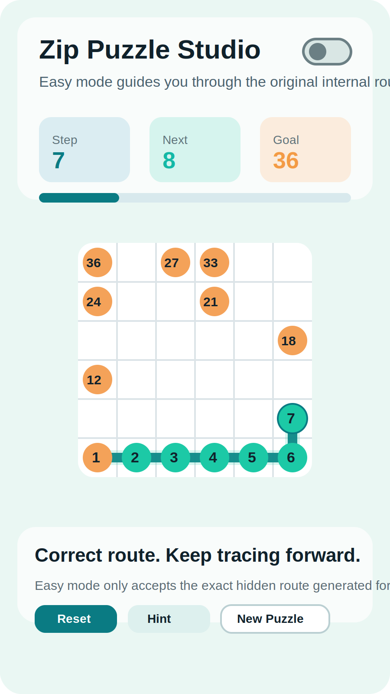
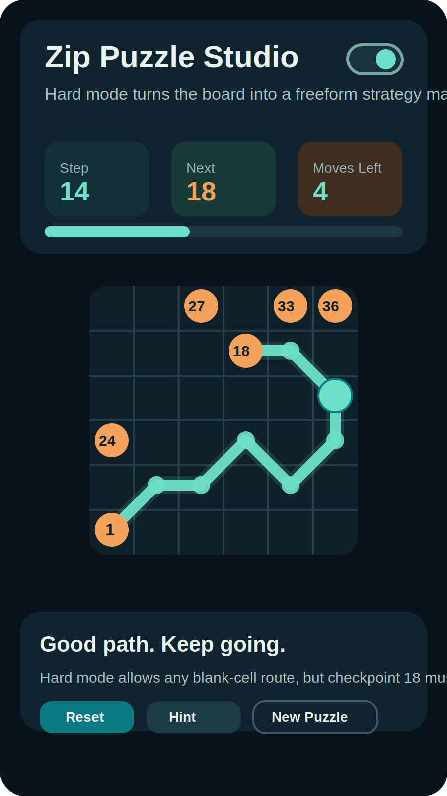

# Zip Puzzle Studio

Zip Puzzle Studio is a Flutter pathfinding puzzle game built around a 6x6 board, sequential checkpoints, and two distinct play styles.

## Highlights

- `Easy` mode follows the hidden original route exactly.
- `Hard` mode allows free movement through blank cells while still enforcing numbered checkpoints.
- Light and dark themes.
- Animated splash screen.
- In-app info and privacy-policy sheets.
- Google Play preparation notes and privacy-policy draft included in `docs/`.

## Screenshots

### Easy Mode



### Hard Mode



## Project Docs

- Privacy policy draft: [docs/privacy_policy.md](docs/privacy_policy.md)
- Google Play Console notes: [docs/google_play_console_notes.md](docs/google_play_console_notes.md)

## Run Locally

```bash
flutter pub get
flutter run
```

## Repository Notes

- Branding and UI copy are written to support an original project identity.
- Copyright notice in app info: `Appruloft`
